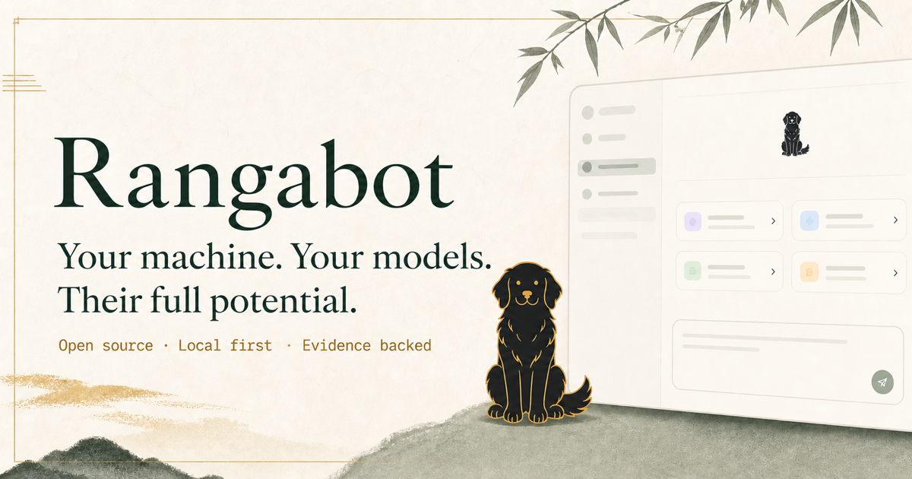
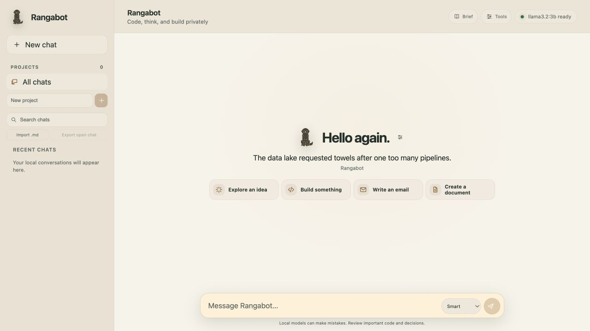
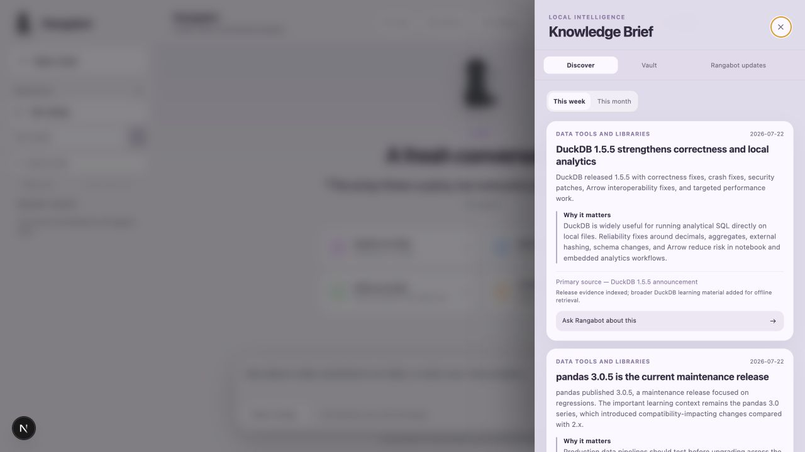

# Rangabot

> **Your machine. Your models. Their full potential.**

Rangabot is an open, local-first personal intelligence system built to help
open-source models reach their full practical potential on the computers people
already own. It combines the user's chosen models, approved knowledge, selective
memory, deterministic tools, and evidence-backed expert capabilities to support
meaningful conversation, learning, coding, analysis, and creation without a
mandatory cloud account, paid API, or specialized machine.



> **Reliability status:** Rangabot is active pre-release software. Core chat,
> local memory, retrieval, and document creation work today, but capability
> quality varies with the installed model. The frozen conversation benchmark
> and its strict acceptance gates are documented in
> [the Core Conversation Contract](docs/CORE_CONVERSATION_CONTRACT.md); a merged
> feature is not automatically a mastered capability.

Project site: [rangabot.com](https://rangabot.com). The site is public, but its
maintainer-controlled publishing source is intentionally not included here because it is not
needed to build, run, audit, or contribute to the open-source application.

## Vision, mission, and north star

Rangabot's canonical [charter](docs/RANGABOT_CHARTER.md) governs product
priorities, architecture, evaluation, public claims, and the Path to Mastery.
Its personal promise is: **Know me. Think with me. Help me do excellent work.
Stay mine.**

The governing decision is whether a change makes Rangabot more useful,
truthful, personal, and capable on ordinary hardware while preserving user
ownership, respecting model limitations, and avoiding unnecessary cost or
compute.

## Product showcase

### A calm local workspace

Start with a private conversation and a rotating greeting. An optional local
name or nickname personalizes the welcome, while Mix, Quotes, Jokes, Thoughts,
or My books is chosen once in local Preferences—not repeatedly on every new
chat. The resting page keeps only one quiet welcome line, four compact starters,
and a one-row composer so conversation remains the visual priority. Rangabot's
warm amber-and-pine signature is joined by traditional Black & White, cool
Graphite, warm Cement, Moss, Harbor, Plum, and Ember. Each adapts across
explicit light and dark environments. Brief and Preferences stay one tap away;
Memory, Analyze, Mastery, and approved folders remain in the compact local
Tools menu.



### Local intelligence and an honest roadmap

The Knowledge Brief presents meaningful technical developments, primary links,
and local-vault status in a focused reading pane.



The generated [Path to Mastery](docs/PATH_TO_MASTERY.md) exposes every
capability's state, dependencies, evidence, and unlock criteria instead of
implying that unfinished work is complete. Its older UI capture is temporarily
withheld until it can be recaptured against the current governed score.

All showcase content is synthetic or public project metadata. No personal chat,
memory, repository content, or private Knowledge Vault document is shown.

## First run

1. Install Node.js 24+ and [Ollama](https://ollama.com/).
2. Run `npm install`.
3. Run `npm run setup` for guided model selection and private vault setup.
4. Run `npm run doctor` to verify the installation.
5. Start with `npm run dev`, then open the private one-launch URL printed in the
   terminal. Do not share that URL. Its fragment is removed before Rangabot
   redirects to the clean local app URL.

Existing installations should run `npm run privacy:repair` once after upgrading
to enforce owner-only permissions on Rangabot-managed private storage. It does
not read or delete the stored content.

On macOS, the development launcher uses a one-second polling watcher to avoid
the desktop session's low file-watcher limit. Linux and Windows retain native
watching. Override with `WATCHPACK_POLLING=false npm run dev` only if your macOS
file limit has been raised and verified.

Experienced users can copy `.env.example` to `.env.local` and use the manual
model guidance in [docs/models.md](docs/models.md).

The server binds only to the local computer by default.
Rangabot also rejects non-loopback Ollama URLs, preventing an environment
configuration mistake from silently sending chats or vault evidence to a remote
model server.

## Current milestone

- Local chat interface
- Local-only / smart-routing / Codex mode controls
- Ollama availability and model detection
- Streaming local Ollama chat responses
- Stop generation control
- Server-owned durable turn lifecycle with idempotent start, one pending turn per
  chat, atomic completed-history commits, reload recovery, and inspectable
  cancelled/failed receipts that never pollute later prompts
- Local SQLite conversation history with reopen, search, pin, delete controls,
  and portable Markdown transcript export/import. Markdown carries text and
  reply references only; it is not a complete conversation backup.
- Chat-focused sidebar with a compact Brief and Tools header, plus a real
  keyboard-accessible mobile chat/project drawer
- Title-first conversation focus stack with readable hover expansion and
  on-demand pin/delete controls
- Markdown responses, GitHub-style tables, syntax-highlighted code, and copy controls
- Local project folders and project-scoped chats
- Explicit local repository allowlisting with reversible access approval
- On-demand scoped code search with bounded, line-numbered local file previews
- Explicit code-preview attachment to a chat, revalidated at send time for local Ollama only
- Conversational Word creation with local requirement gathering, DOCX validation, rendered previews and download
- Private 4 GB Knowledge Vault with PDF, DOCX, HTML, Markdown, and text ingestion
- Hybrid local keyword and embedding retrieval
- Per-answer `HYBRID` or `KEYWORD ONLY` retrieval status, so an unavailable
  embedding model never degrades silently
- Conversation-aware follow-up retrieval that carries the latest user topic into
  locally searched questions such as “What about its limitations?”
- Teacher Mode with passage citations and explicit evidence limits
- Automatic local Knowledge Vault lookup for informational questions in Smart mode
- Weekly and monthly sourced subject-intelligence briefs
- Dedicated Knowledge Brief panel with news cards, vault status and app changelog
- Personalized fresh-chat greeting with an optional browser-local name or
  nickname and rotating wording
- Fresh-chat Mix, Quotes, Jokes, Thoughts, and My books filters; book mode shows
  one locally indexed, cited sentence and an explicit empty state when no safe
  fact is available
- Offline welcome library with 100 quotes, 100 jokes and 100 thoughts, plus a 60-item no-repeat window
- No enabled cloud chat or private-data handoff at runtime
- Signed same-origin local API boundary, blocked remote Markdown resources,
  bounded per-model execution and output, and owner-only private storage on
  POSIX systems
- Interactive **Path to Mastery** at `/mastery`, generated from the same strict
  capability data used by the public contributor backlog. Version 3 maps all
  work into nine charter-aligned paths: Mind & Memory, Scholar, Analyst,
  Builder, Creator, Personal Companion, Model Steward, Guardian, and Open
  Platform. Its current strict readiness is 7/45 capabilities; weighted
  development progress is not presented as readiness

Conversation data stays in `data/rangabot.db` on this computer. The database and
its journal files are excluded from Git.

Fresh-chat personalization is deliberately separate from Rangabot memory. The
optional name or nickname, selected welcome category, and recent welcome item
identifiers stay in browser-local storage; they are not added to a chat, the
Memory panel, the Knowledge Vault, or an Ollama prompt. My books reads bounded
windows from the existing local Knowledge Vault index and returns one cited
sentence to the browser. The feature does not persist that sentence as welcome
history; only an opaque identifier is retained to reduce immediate repetition.

Repository approvals stay in the private, Git-ignored
`data/repositories.json` file. Adding a repository records its canonical folder
path and server-only filesystem identity. Selecting an approved repository opens
on-demand code search.
Rangabot reads only eligible text/code files after an explicit search, skips
secrets, symlinks, dependencies and build output, revalidates the approved root
before each bounded read, and never creates a background repository index.
An attached preview is visibly listed above the composer before sending. Saved
chats retain only the repository, file and line-range reference; the raw source
preview is read again at send time and supplied only to the local Ollama model.

Dataset approvals use a stricter equivalent boundary. Rangabot binds approval
to the canonical file identity and SHA-256, then runs DuckDB against an
owner-only read-only snapshot of those exact bytes. A replaced, symlinked, or
modified file requires explicit reapproval; request snapshots are removed after
success, failure, timeout, or cancellation.

### Conversational local analysis

Rangabot treats SQL as a reasoning tool, not the primary interface. Open
**Analyze**, approve a CSV, Parquet, or DuckDB file, and choose **Use selected data in
chat**. That grants the current conversation persistent, revocable, read-only
analytical access. The file approval is stored once in the private local
allowlist; each chat remembers its selected dataset and restores it when
reopened, without asking for the path again. Removing the attachment affects
only that chat, while revoking approval disables it everywhere. Ask a normal
question: Rangabot detects when calculation is
needed, sends only column names and types to local Ollama for planning, validates
one `SELECT`, executes it inside bounded local DuckDB, and explains the verified
result. Non-analytical messages do not touch the dataset.

Multi-table DuckDB planning is experimental. `npm run conversation:evaluate:sql`
creates a private deterministic eight-table commerce database and runs 50 cases
(10 easy, 15 medium, 20 hard, 5 extreme). The original free-form
`llama3.2:3b` baseline was 3/50. The first constrained compiler reached 12/50
overall and 9/10 easy. A later 26/50 result is intentionally not published as a
capability gain because its implementation encoded benchmark-domain concepts.
The replacement is schema-derived and has no benchmark table names in production
planning code, but its first frozen logistics holdout passed only 5/12. Keep the
calculation trace visible and verify the query: analytical planning remains below
the release gate.

The next semantic increment adds distinct populations, nested aggregation and
local categorical-value grounding behind one model-independent contract. It
passes 185/185 deterministic tests, but an unseen ecology transfer audit passed
only 3/13 under strict semantic review. The initially printed 6/13 included
three coincidental scalar matches generated from the wrong operation or grain.
Future holdouts therefore require both an expected semantic-plan match and the
correct executed result. This remains experimental for every model, not merely
the default `llama3.2:3b` profile.

For supported requests whose population, grain, measure and relationships are
all uniquely resolved from the approved schema, Rangabot now compiles the plan
without waiting for a model planner. Ambiguous requests still use the typed
local-model fallback or ask a focused question. The 9-case development suite
passes 9/9 in 196 ms total. Astronomy v4 initially passed 10/12 (83.3%); its two
failures exposed relation-grain ambiguity and a model-dependent conditional-rate
clarification. Generic post-grounding source resolution and whole-population
rate recovery repaired v4 to 12/12 as regression evidence. The separately
frozen, structurally isomorphic theatre v5 suite then passed 12/12 on its first
retained clean run at commit `23f5e2c`, with all 12 pack audits, all 11 result
comparisons and zero evaluator errors. This meets the manifest's 90% single-run
overall-score threshold on that precommitted domain-and-name transfer check; it
does not establish broad generalization or complete pack qualification.

`npm run conversation:evaluate:sql:holdout` runs the separate frozen logistics
transfer suite. Once run, that version is evidence only and must not become a
tuning set; subsequent improvements require a newly frozen unseen holdout.
Holdout runners preflight every reference query before invoking the model so an
evaluator defect cannot be counted as a Rangabot failure.
`npm run conversation:evaluate:sql:pack` retains astronomy v4 as a regression
suite. Theatre v5 is available through
`npm run conversation:evaluate:sql:holdout:v5 -- --expert-pack`, but its retained
first result—not later reruns—is the precommitted isomorphic transfer check. The
runner does not enforce an immutable one-run lock, so later runs must be reported
only as regression evidence.

The trusted audit also fails closed on semantic scope: an unsupported denominator
cannot be dropped, mixed Boolean polarity cannot become a one-sided percentage,
and a distinct count cannot default to an entity table when no observation
relation is evidenced. These cases produce a focused clarification rather than a
plausible but population-changing query.

After those audit fixes, clean production commit `d0077fd` retained 12/12 on
both astronomy v4 and theatre v5 as regression checks, with zero evaluator
errors. A final diagnostic baseline then captured the rejected drafts instead of
counting only the safe fallback: theatre v5 attempted 11 free-form narrations and
accepted 0, with 11 unsupported-language, five false-limitation, and six
unsupported-number failures.

Analytics Pack `0.2.0` removes that unreliable free-form narration authority.
It retains the validated plan as a typed object, compiles exact cell facts and
operation-defined units, and renders the answer through trusted code. A
structural audit rejects forged numbers, cells, bounds, receipts, operation-
specific aliases/cardinality, or any post-render mutation. Every verified filter
is shown or its display omission is explicit; local data cannot create active
Markdown links or images. Model-authored planning explanations never enter the
answer. The frozen zero-model-call narration suite passes 44/44 canonical cases
and rejects 222/222 adversarial mutations and invalid result shapes. On clean
implementation commit `45d3ff1`, unchanged astronomy v4 and theatre v5
regressions each pass 12/12 with 11/11 structurally valid trusted narrations and
zero evaluator errors. V5 mean latency fell from 5,014.8 ms on the preserved
free-form baseline to 210.1 ms because the second narration model call was
removed. These results prove renderer grounding and regression safety, not broad
analytical planning or human usefulness. Run the frozen renderer suite with
`npm run conversation:evaluate:sql:narration` and see the
[narration contract](docs/ANALYTICAL_NARRATION_CONTRACT.md).

Every answer exposes an optional **How this was calculated** trace with the
query, dataset name, row count, timing, and input/query fingerprints. Model
provenance appears only when a model actually resolved the plan; deterministic
plans and the trusted renderer do not claim a model call. The advanced SQL
workspace remains available for manual inspection and exact one-time execution. See
[`docs/LOCAL_EXECUTION_ARCHITECTURE.md`](docs/LOCAL_EXECUTION_ARCHITECTURE.md).

## Artifact skills

Rangabot now creates new `.docx` files through normal chat. Ask it to make a Word
document at any point; it remembers the active document request, asks one natural
follow-up at a time for missing requirements, then creates the file from the
conversation. The configured local Ollama model produces the structured draft,
while deterministic code applies styles, stores the artifact under
`data/artifacts/`, validates it, and renders local previews when LibreOffice and
Poppler are installed. Creative requests use genre-aware layouts and must contain
finished reader-facing content; planning notes and generic source-material
fallbacks are rejected. A curated local Ramayana story pack provides dependable
child-friendly plot facts when smaller models cannot safely retell the episodes.
Existing-file editing and the remaining artifact abilities
are separate backlog items. See [the artifact delivery plan](docs/ARTIFACT_SKILLS.md)
for the ordered backlog and quality contract.

Run `npm run setup` to initialize the private artifact directory and
`npm run doctor` to check whether optional Word page-preview tools are available.
DOCX creation still works when those tools are absent, but Rangabot will show a
visual-review warning instead of claiming that page rendering passed.

## Knowledge Vault

Put documents in `data/knowledge/inbox/` and run:

```bash
npm run knowledge:ingest
```

The importer hashes every file, skips unchanged material, extracts text locally,
splits it into small teaching passages, builds an SQLite FTS5 index, and creates
embeddings through the local Ollama embedding model. PDF extraction includes
quality validation: empty HTML, image-scanned PDFs, and page-marker-only output
are rejected rather than being advertised as searchable knowledge. Run
`npm run knowledge:doctor` after adding sources; image-only PDFs must first be
processed with a local OCR tool such as OCRmyPDF.
DOCX, HTML, Markdown, and plain-text files are also supported.

Knowledge Doctor streams file signatures and stops its deep synchronization scan
after 30 seconds instead of appearing frozen on a large vault. The basic document,
passage, storage, and compatibility status still prints first. For a deliberate
long scan, set `KNOWLEDGE_DOCTOR_TIMEOUT_MS` from `1000` to `300000` milliseconds,
for example `KNOWLEDGE_DOCTOR_TIMEOUT_MS=120000 npm run knowledge:doctor`.

Ingestion format v2 preserves document, heading hierarchy, section path, and PDF
page ranges on each passage. DOCX and HTML headings are retained, Markdown
headings are interpreted directly, and common plain-text chapter/section labels
are detected. Existing compatible vault files migrate automatically through one
full local re-index; later unchanged runs skip them normally.

Semantic retrieval uses a compact native `sqlite-vec` index stored inside the
private Knowledge Vault database. Rangabot builds it automatically from existing
embeddings on the first semantic search and invalidates it whenever indexed
documents change. You can also rebuild it explicitly with:

```bash
npm run knowledge:vector-index
```

This does not re-read books or regenerate embeddings. If the native extension
cannot load on a supported system, retrieval safely falls back to the existing
JavaScript similarity scan instead of making the vault unavailable.

Create a private, validated Knowledge **index database** backup with:

```bash
npm run knowledge:backup
```

New backups use SQLite's online backup API, receive a SHA-256 integrity sidecar,
and are checked before completion. Rangabot keeps the newest 12 by default;
set `RANGABOT_KNOWLEDGE_BACKUP_RETENTION` from 2 to 100 to change that limit.
This backs up the generated `knowledge.db` index only; original inbox/source
books are not included and need their own private backup.
To inspect the latest backup, run `npm run knowledge:rollback` without `--yes`.
To restore it, stop Rangabot and follow the printed confirmation command. Restore
validates and stages the backup before replacing the live index, and preserves a
private recovery copy of the replaced index. The app and rollback command share
one local runtime lease, so a restore refuses to start while Rangabot is live and
Rangabot cannot start halfway through a restore.

Measure retrieval quality against the local vault with:

```bash
npm run knowledge:evaluate
```

The 60-question starter suite spans ten subject groups and three difficulty
levels. It checks expected-source coverage, cross-subject contamination,
multi-source retrieval, passage locators, latency, and per-subject performance. Detailed results are
written to a private Git-ignored directory. Contributors can add a private suite
at `data/knowledge/evaluations/my-vault.private.json` and run it with
`npm run knowledge:evaluate -- --file=data/knowledge/evaluations/my-vault.private.json`.
Private evaluation files may name personal textbooks and must never be committed.

Run the slower end-to-end Teacher Mode benchmark with:

```bash
npm run knowledge:evaluate:answers
```

It generates and locally reviews all 60 answers, then measures required-concept
coverage, grounding, forbidden claims, cross-source citation synthesis, revision
rate, and latency. Use `-- --sample=10` for one case per subject,
`-- --limit=5`, or `-- --subject=statistics` for smaller diagnostic runs. Full
runs can take a long time on lightweight local hardware.
The runner allows five minutes per local generation, catches isolated failures,
checkpoints every completed answer, and automatically resumes the same selected
suite. If it is interrupted or a model call times out, rerun the identical
command instead of starting over. Override the evaluation-only timeout with
`-- --timeout-ms=600000` when exceptionally slow hardware needs ten minutes.
Execution errors are excluded from completed-case quality and latency averages;
an interrupted run also prints a conservative overall pass floor until retries
finish.

Select **Teacher mode** in Rangabot to retrieve relevant vault passages before
the chat model answers. Teacher Mode is instructed to cite the numbered local
sources, identify gaps, and preserve conflicting historical or mythological
interpretations. It may add clearly labelled background from the downloaded
local model, but never presents that material as source-verified or current.
Before showing a Teacher Mode answer, Rangabot audits substantive paragraphs
for missing, invalid, or weakly supported citations. It first attempts fast,
deterministic evidence/background separation and requests one local-model
revision only when the unchanged audit still fails. A grounding warning appears
if that selective revision remains insufficient. This quality gate buffers
Teacher Mode answers until review finishes; ordinary and Smart-mode responses
continue streaming.
Teacher Mode also builds a visible-to-the-model evidence plan before drafting:
requested subtopics, source labels, query/source overlap, and a strict writing
contract. If revision still mixes supported and unsupported material, Rangabot
conservatively attaches a missing citation only when one passage has strong
lexical support, then separates remaining content into **Vault-grounded answer**
and **Local model background** sections. It never silently labels weakly matched
background as vault evidence.

The evidence plan also maps each requested part of a question to up to two
matching passages. If the first draft misses the grounding threshold, Rangabot
first tries the deterministic separation locally and rechecks the same gate. It
requests a slower second model generation only when that safe transformation is
not enough, preserving citation reliability while avoiding unnecessary work.
When several books contain strong matches, Rangabot reserves evidence space for
multiple sources and asks the model to connect their ideas rather than reciting
each passage separately. Weak books are not included merely to create diversity.
Title-level subject guards also remove clearly cross-domain books while leaving
uncategorized sources available for ordinary relevance ranking.

**Smart routing** also searches the vault automatically for informational and
subject-related questions. Responses visibly show `LOCAL · KNOWLEDGE VAULT`
when retrieval was used. Smart mode may fill evidence gaps from the downloaded
chat model and labels vault citations; Teacher Mode is the citation-first option
for deeper teaching with explicit evidence boundaries.

Private source files and generated indexes are Git-ignored. The tracked
`SOURCE_MANIFEST.json` contains only public starter-source metadata; weekly and
monthly reports describe meaningful changes without publishing book content.

Ask **“What’s new in data science this week?”** in Teacher Mode to read the
saved local intelligence brief. These briefs cover meaningful developments in
the subjects themselves—not Rangabot implementation work—and include dates,
why each item matters, evidence type, source links, and indexing status. The
current data-science pack adds official NumPy 2.5, pandas, scikit-learn, and
DuckDB learning/release material. Briefs are indexed too, so they remain
available offline after the weekly source check.

### Inspectable local memory

Open **Local memory** in the sidebar to save a preference, user-provided fact,
or standing instruction. Rangabot never infers durable memories from a chat:
each item requires an explicit **Approve and remember** action and records its
origin, confidence, and timestamps in the private local SQLite database
`data/rangabot-memory.db`. Rangabot deterministically selects at most six
memories relevant to the current request; unrelated saved facts are not placed
in the model prompt. Broad answer-style preferences remain available across
subjects, while domain-scoped preferences require matching subject context.
Related vocabulary such as PySpark/Spark and chart/plot is matched locally;
explicit current technology choices exclude conflicting preferences, and the
newest same-purpose memory supersedes older entries. The panel supports review, editing, JSON export,
and deletion; no memory is sent to a remote service. Answers visibly show
**MEMORY** only when selected context was supplied and add safe titles such as
**Answer style** or **Preferred name**—never the saved value itself. **DIRECT
RECALL** identifies a fact resolved deterministically rather than left to model
improvisation.

Use **Import JSON** to restore or migrate a Rangabot memory export. Import is a
two-step local review: new items, skipped duplicates, and conflicts are shown
before any write. Existing memories win every conflict by default; replacing one
requires selecting that specific imported version and then approving the review.
Imports are capped at 200 memories and 300 KB, require explicit user-approved
provenance, and never contact a cloud service.

### Conversation quality evaluation

Run `npm run conversation:evaluate` to stress the configured local model against
synthetic conversations covering helpfulness, format compliance, follow-up
continuity, corrections, uncertainty, reasoning, tone, and Local memory safety.
The versioned 60-case suite balances twelve capability groups with five cases
each. It records the suite version, Git commit, model, Ollama version, context
configuration, host profile, cold/warm state, timing, and execution errors.
Critical privacy and truthfulness cases are reported separately and must reach
100%; the overall target is at least 90%, with no capability below 80%.
The evaluator never reads real chats or the live memory database. Full answers
and latency are written only to the ignored local directory
`data/evaluations/results/`, making regressions inspectable without publishing
private model output. `npm run conversation:evaluate:baseline` preserves the
pre-orchestration behavior for diagnostic comparison. The earlier 20-case
exploratory result is not comparable with the frozen v1 suite and must not be
presented as a product-quality score.

Run `npm run conversation:evaluate:memory` for the separate deterministic
selector audit. Its 24 synthetic scenarios measure relevance precision and
recall directly without calling a model or opening the live memory database.
This audit is part of `npm run check`; every scenario must pass in addition to
the contract gates of at least 95% precision and 90% recall.

Use `npm run conversation:evaluate -- --critical-only` for a repeated critical
trust diagnostic. It is deliberately marked as a partial selection and cannot
replace the complete-suite result. The current request path and invariants are
documented in the [Mind & Memory release architecture](docs/MIND_MEMORY_ARCHITECTURE.md).

The final release decision is stricter than one successful run. It requires one
clean 60-case result from the exact candidate, three separate 22-case critical
runs from that same commit and model profile, and a twelve-answer blind review
completed by a person. `npm run conversation:release:gate` recomputes those
machine and human gates rather than trusting their saved summaries. The frozen
selection, rating rubric, private-file workflow, and exact commands are in the
[blind-human review protocol](docs/CONVERSATION_HUMAN_REVIEW.md). No model,
Rangabot, or Codex review counts as the human gate.

`npm run conversation:reviewer:qualify` tests whether the configured local model
is safe to use as an answer critic. Qualification requires 12/12: six incorrect
drafts corrected and six correct drafts preserved. A failed qualification exits
non-zero and never enables review in the app. Full reviewer outputs remain in
the ignored private evaluation directory.

Ordinary chat now uses a provider-independent Rangabot contract and a bounded
recent-history window. Relevant approved memories may shape an answer, but the
latest explicit user correction always wins and unrelated memories remain
outside the model request. A deterministic semantic task frame also preserves
the current turn's intent, named subject, audience, tone, depth, and diagnostic
direction before any supported model generates. It adds no factual answer and
cannot manufacture knowledge a model lacks; it exists to reduce adjacent-topic,
generic-checklist, and wrapper-text drift across models.

Saved chat uses the versioned lifecycle documented in the contract. A start
retry reuses the same UUID, the server reconstructs history and options, and
only a completed stream atomically joins canonical history. Failed or stopped
partials remain visible for diagnosis but are excluded from prompts, search, and
portable Markdown. `RANGABOT_TURN_TIMEOUT_MS` may set the absolute local turn
deadline from 1 second through 15 minutes; the default is five minutes.

Cross-model reliability can be measured sequentially with
`npm run conversation:evaluate:matrix`. The runner uses the same frozen cases
and orchestration for every registered Ollama profile, records the configured
context, keeps complete answers private and unloads each model before starting
the next. See [local model guidance](docs/models.md) before overriding a model's
memory-fit guard.

The [Expert Pack Contract](docs/EXPERT_PACK_CONTRACT.md) defines how installable
Analytics, Scholar, Documents, Builder and Research capabilities remain governed
by the same Mind & Memory control plane. Analytics `0.2.0` is the first bundled
experimental reference: an attached-data request receives exact conversation-
and dataset-scoped grants, all schema/grounding/final reads use one cancellable
read-only adapter, every actual local-model use is explicit, and the result carries
validated evidence, canonical answer claims and execution receipts bound to the
exact approved input and query. DuckDB runs
inside a hard-kill process boundary so Stop and absolute timeouts cannot strand a
native query. The route and client reject execution traces that do not match the
validated evidence. Run the retained astronomy regression path with
`npm run conversation:evaluate:sql:pack`; run the separately frozen v5 check with
`npm run conversation:evaluate:sql:holdout:v5 -- --expert-pack`.

This is not a pack manager or a complete qualification claim. Runner 2.1.2 and
result comparator 1.0.0 recorded a clean first theatre-v5 transfer run of 12/12
at commit `23f5e2c` (4.8-second mean, 5.2-second median, 6.7-second P95, zero
evaluator errors), with all 12 terminal/evidence/receipt audits and all 11
executed-result comparisons passing. That historical run rejected all 11
free-form narrations. Pack `0.2.0` replaces that path with the separately frozen
trusted renderer; semantic execution still meets only the manifest's single-run
threshold on an isomorphic check. Broad transfer, richer interpretation,
required critical repetitions, cross-model planning evidence and blind human
usefulness remain unqualified. Saved per-pack model choices, automatic/custom switching,
install/update/remove flows, resource lifecycle and the other packs are still
roadmap work. No mode downloads a model or enables the internet.

Teacher Mode generation can be compared explicitly with
`npm run knowledge:evaluate:answers -- --model=qwen2.5:7b --num-ctx=4096 --sample=5`.
Retrieval-only evaluation does not use the chat model. Model-specific answer
checkpoints are isolated so results cannot be accidentally reused across
profiles.

## Next milestones

1. Add conversation-aware query planning and multi-book evidence synthesis using the
   downloaded model, vault sources, and relevant chat context.
2. Validate inspectable local memory across chat sessions, then add cross-book concept summaries.
3. Add draft, grounding, revision, feedback, and regression-evaluation loops so
   improvement is measured rather than assumed.
4. Continue the artifact roadmap with existing-Word editing, PDF, email drafting,
   long-form writing, technical documentation, presentations, and spreadsheets.

Model management remains deferred. Cloud/Codex handoff remains disabled pending
a separately approved disclosure and consent design.

## Contributing

[Path to Mastery](docs/PATH_TO_MASTERY.md) is the maintainer-assessed public
program map and backlog: 9 epics, 45 capabilities, and 161 criteria. Scores and
states are calculated from maintainer-reviewed criterion assessments in
[`content/path-to-mastery.json`](content/path-to-mastery.json); cited PRs are
validated against the merged-PR
[evidence registry](content/mastery-evidence.json) and prove merge only, not an
acceptance-gate result. Node/path aggregates are generated rather than typed by
hand. Official
contribution claims must use the Mastery contribution issue template, cite
merged evidence and pass the [official approval process](docs/mastery-claims.md);
direct self-awards are rejected by the metadata-only governance workflow. A
2026-08-10 settings audit observed its named check as required on `main`; because
GitHub settings are mutable, current enforcement must be reverified
independently.

Rangabot welcomes community development. Read
[CONTRIBUTING.md](CONTRIBUTING.md), [SECURITY.md](SECURITY.md), the
[architecture](docs/architecture.md), [privacy model](docs/privacy.md), and
[model guide](docs/models.md). Interface contributions should follow the
[Rangabot design language](docs/design-language.md). Run `npm run check` before submitting a pull
request. Codex is optional; all required maintenance paths are normal scripts,
documentation and GitHub workflows.

New contributors can browse
[`good first issue`](https://github.com/saketh-viswanadh/rangabot/labels/good%20first%20issue)
and [`help wanted`](https://github.com/saketh-viswanadh/rangabot/labels/help%20wanted)
tasks, or introduce themselves in
[GitHub Discussions](https://github.com/saketh-viswanadh/rangabot/discussions).

CI validates Linux and Windows on every pull request; macOS is covered by the
documented clean-clone release rehearsal. Starter-source licensing and the
local-download-only policy are documented in
[docs/source-licensing.md](docs/source-licensing.md).

The informational website is maintained in a maintainer-local, Git-ignored and
currently untracked Sites workspace. Repository CI and contributor setup have no
website dependency; only merged, synthetic, public-safe evidence may be
published there. The source is absent from the current tracked tree but remains
recoverable from public history and older branch/PR copies. A durable private
source repository is still planned, so the local ignored workspace must be
backed up independently.

Source code and documentation use Apache-2.0. Original Ranga artwork uses CC BY
4.0 with attribution. The Rangabot naming policy is documented in
[BRANDING.md](BRANDING.md).

The 2026-08-02 engineering audit is retained in
[docs/code-review.md](docs/code-review.md). PR #100's merged privacy-boundary
closure, cross-platform validation, and remaining historical or environmental
risks are recorded in this changelog, `DAILY_PROGRESS.md`, and `SECURITY.md`.
