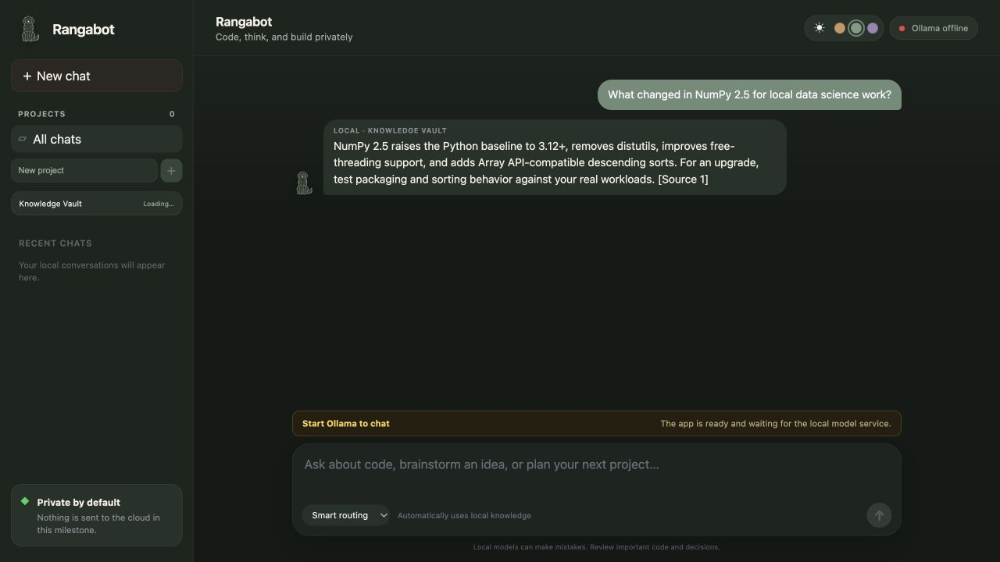

# Rangabot

A beautiful, local-first assistant for private chat, coding, brainstorming and
teaching from your own documents. Rangabot uses downloaded Ollama models and a
local Knowledge Vault; cloud handoff remains disabled.



## First run

1. Install Node.js 24+ and [Ollama](https://ollama.com/).
2. Run `npm install`.
3. Run `npm run setup` for guided model selection and private vault setup.
4. Run `npm run doctor` to verify the installation.
5. Start with `npm run dev` and open `http://127.0.0.1:3000`.

Experienced users can copy `.env.example` to `.env.local` and use the manual
model guidance in [docs/models.md](docs/models.md).

The server binds only to the local computer by default.

## Current milestone

- Local chat interface
- Local-only / smart-routing / Codex mode controls
- Ollama availability and model detection
- Streaming local Ollama chat responses
- Stop generation control
- Local SQLite conversation history with reopen, search, pin, Markdown backup/restore and delete controls
- Markdown responses, GitHub-style tables, syntax-highlighted code, and copy controls
- Local project folders and project-scoped chats
- Private 4 GB Knowledge Vault with PDF, DOCX, HTML, Markdown, and text ingestion
- Hybrid local keyword and embedding retrieval
- Teacher Mode with passage citations and explicit evidence limits
- Automatic local Knowledge Vault lookup for informational questions in Smart mode
- Weekly and monthly sourced subject-intelligence briefs
- Dedicated Knowledge Brief panel with news cards, vault status and app changelog
- Offline welcome library with 100 quotes, 100 jokes and 100 thoughts, plus a 60-item no-repeat window
- No cloud transmission

Conversation data stays in `data/rangabot.db` on this computer. The database and
its journal files are excluded from Git.

## Knowledge Vault

Put documents in `data/knowledge/inbox/` and run:

```bash
npm run knowledge:ingest
```

The importer hashes every file, skips unchanged material, extracts text locally,
splits it into small teaching passages, builds an SQLite FTS5 index, and creates
embeddings through the local Ollama embedding model. PDF extraction includes
page markers. DOCX, HTML, Markdown, and plain-text files are also supported.

Select **Teacher mode** in Rangabot to retrieve relevant vault passages before
the chat model answers. Teacher Mode is instructed to cite the numbered local
sources, identify gaps, and preserve conflicting historical or mythological
interpretations instead of silently inventing an answer.

**Smart routing** also searches the vault automatically for informational and
subject-related questions. Responses visibly show `LOCAL · KNOWLEDGE VAULT`
when retrieval was used. Smart mode may fill evidence gaps from the downloaded
chat model and labels vault citations; Teacher Mode remains the strict option
when answers must stay within indexed sources.

Private source files and generated indexes are Git-ignored. The tracked
`SOURCE_MANIFEST.json` contains only public starter-source metadata; weekly and
monthly reports describe meaningful changes without publishing book content.

Ask **“What’s new in data science this week?”** in Teacher Mode to read the
saved local intelligence brief. These briefs cover meaningful developments in
the subjects themselves—not Rangabot implementation work—and include dates,
why each item matters, evidence type, source links, and indexing status. The
current data-science pack adds official NumPy 2.5, pandas, scikit-learn, and
DuckDB learning/release material. Briefs are indexed too, so they remain
available offline after the weekly source check.

## Next milestones

- Repository selection and local code search
- Page-aware citation display and source preview controls
- Curated technical, history, and mythology source packs
- Retrieval evaluation fixtures by subject
- Model management and active model selection (deferred)
- Cloud handoff preview and approval
- Model registry, evaluation, updates, and rollback
- Safe daily feature-branch automation

## Contributing

Rangabot welcomes community development. Read
[CONTRIBUTING.md](CONTRIBUTING.md), [SECURITY.md](SECURITY.md), the
[architecture](docs/architecture.md), [privacy model](docs/privacy.md), and
[model guide](docs/models.md). Run `npm run check` before submitting a pull
request. Codex is optional; all required maintenance paths are normal scripts,
documentation and GitHub workflows.

New contributors can browse
[`good first issue`](https://github.com/saketh-viswanadh/rangabot/labels/good%20first%20issue)
and [`help wanted`](https://github.com/saketh-viswanadh/rangabot/labels/help%20wanted)
tasks, or introduce themselves in
[GitHub Discussions](https://github.com/saketh-viswanadh/rangabot/discussions).

CI validates Linux and Windows on every pull request; macOS is covered by the
documented clean-clone release rehearsal. Starter-source licensing and the
local-download-only policy are documented in
[docs/source-licensing.md](docs/source-licensing.md).

Source code and documentation use Apache-2.0. Original Ranga artwork uses CC BY
4.0 with attribution. The Rangabot naming policy is documented in
[BRANDING.md](BRANDING.md).
